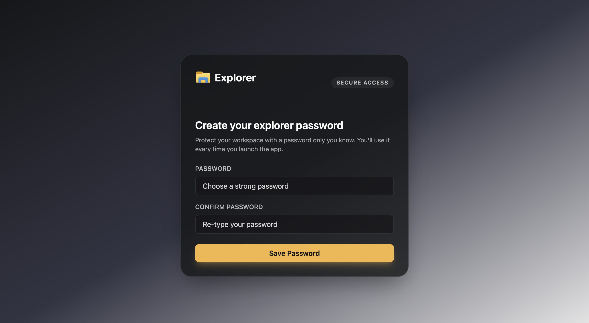
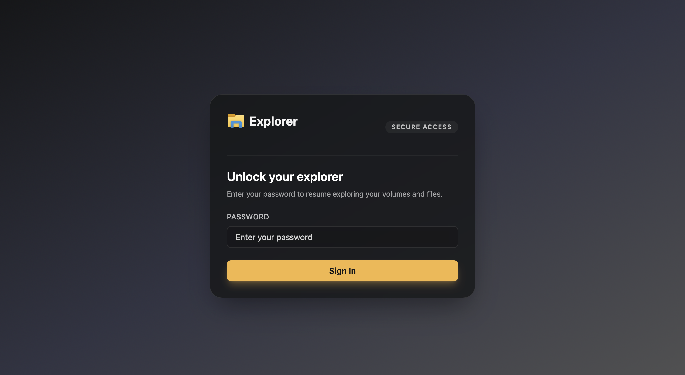
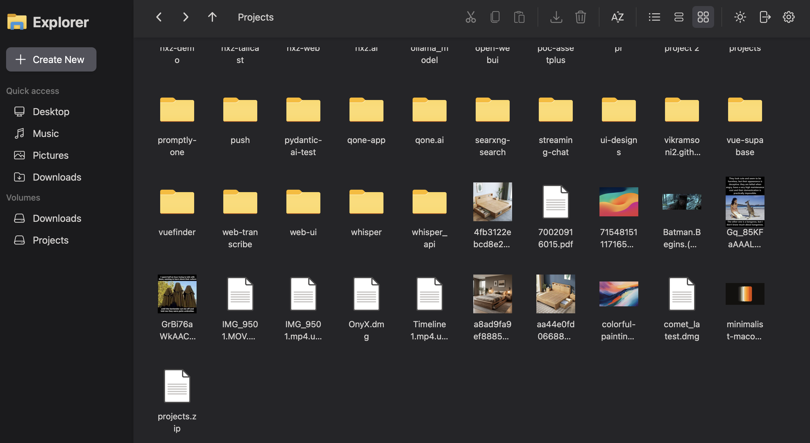
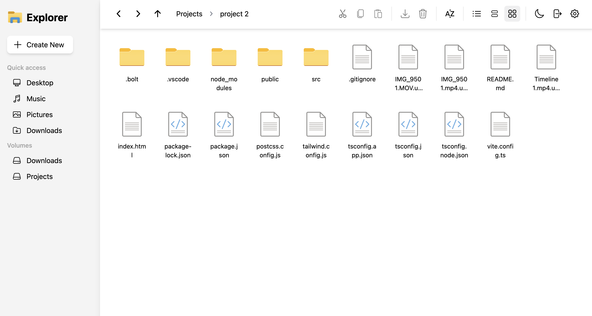
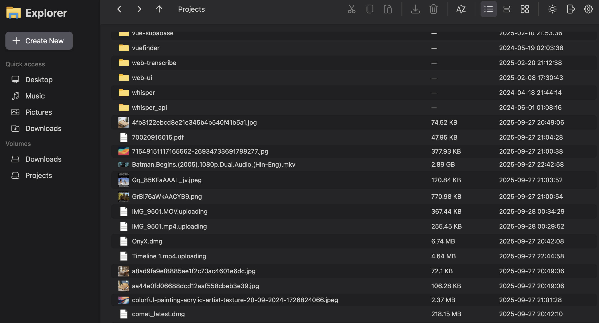
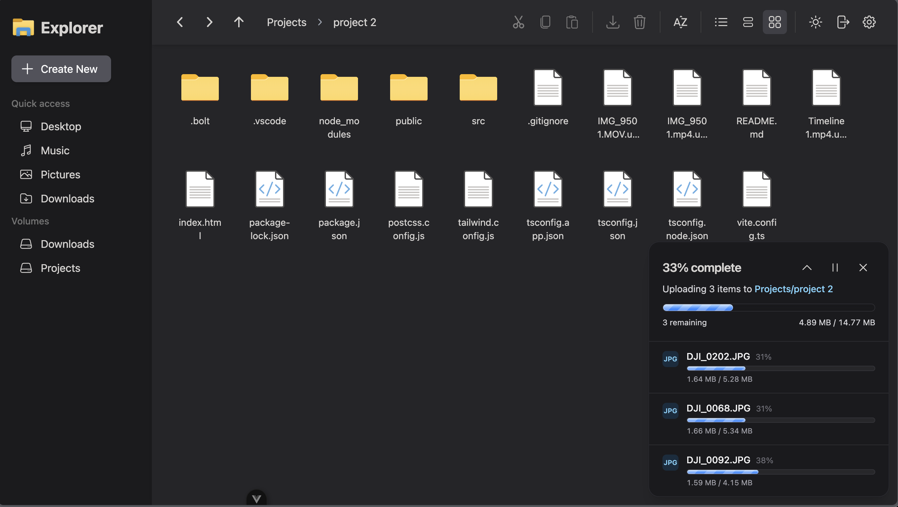

# nextExplorer

A modern, self-hosted file explorer with secure access control, polished UX, and a Docker-friendly deployment story.

## Feature Highlights
- Protect shared workspaces with a launch-time password gate.
- Browse, preview, upload, move, and delete files across multiple mounted volumes.
- Switch between light and dark layouts, plus grid or detail views for folders.
- Generate and cache thumbnails for images and videos to keep navigation fast.
- Edit text-based files inline with a built-in, syntax-aware code editor.
- Preview Images and Videos using in-built viewer

## Screenshots
| | |
| --- | --- |
|  |  |
| Lock the workspace with a master password before anyone can browse. | Re-enter the password to unlock trusted sessions. |
|  |  |
| Grid view keeps media heavy folders easy to scan. | Light theme works well for bright shared spaces. |
|  |  |
| Detail view surfaces metadata like file size and timestamps. | Track multi-file uploads with per-item progress feedback. |

## Self-Host with Docker Compose

### 1. Prerequisites
- Docker Engine 24+ and Docker Compose v2.
- Host directories that you want to expose to the explorer.
- A writable cache directory for generated thumbnails (recommended: SSD-backed storage).

### 2. Prepare host folders
Create or pick folders you plan to mount, for example:
- `/srv/nextexplorer/cache` for cached thumbnails and settings.
- `/srv/data/Projects` and `/srv/data/Downloads` for content you want to browse.
Ensure the Docker user has read/write permissions to each directory.

### 3. Compose file
Create `docker-compose.yml` alongside your other infrastructure files:

```yaml
services:
  nextexplorer:
    image: nxzai/explorer:latest
    container_name: nextexplorer
    restart: unless-stopped
    ports:
      - "3000:3000"  # host:container
    environment:
      - NODE_ENV=production
      # Optional: match the container user/group to your host UID/GID
      # - UID=1000
      # - GID=1000
    volumes:
      - /srv/nextexplorer/cache:/cache
      - /srv/data/Projects:/mnt/Projects
      - /srv/data/Downloads:/mnt/Downloads
```

Every folder you mount under `/mnt` becomes a top-level volume inside the app. Add as many as you need by repeating the `/path/on/host:/mnt/Label` pattern.

### 4. Launch
Run the stack from the directory containing your Compose file:

```bash
docker compose up -d
```

The API and UI are both served on `http://localhost:3000`.

### 5. First-run setup
1. Open the app in your browser.
2. Set a password when prompted; this gate protects all future sessions.
3. Browse the Volumes panel to verify each mount shows up as expected.
4. Start uploading or editing files—thumbnails will populate the cache automatically.

### 6. Updating
To pull the latest release:

```bash
docker compose pull
docker compose up -d
```

The container persists user settings in `/cache` and never touches the contents of your mounted volumes unless you explicitly upload, move, or delete items through the UI.

## Need Something Else?
- For local development, see [`README-development.md`](./README-development.md).
- Issues or feature ideas? Open a ticket on the project tracker or start a discussion with the maintainers.
