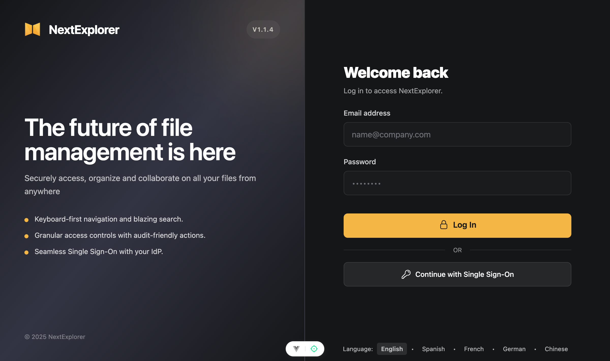
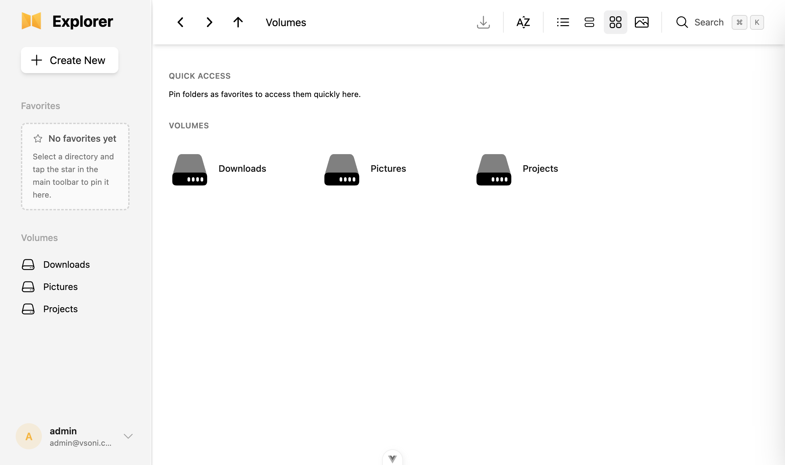
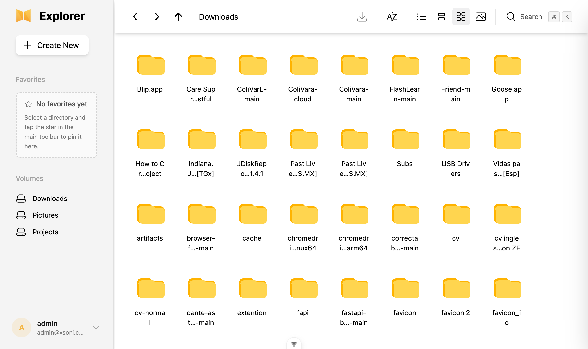
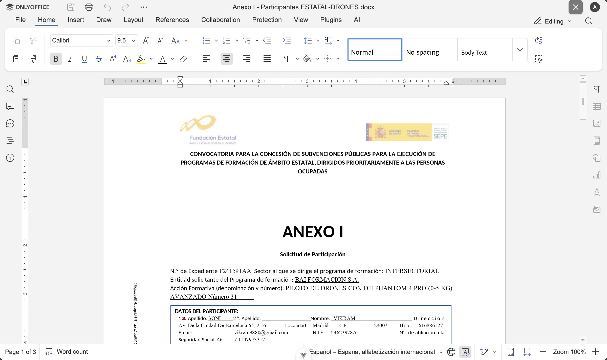
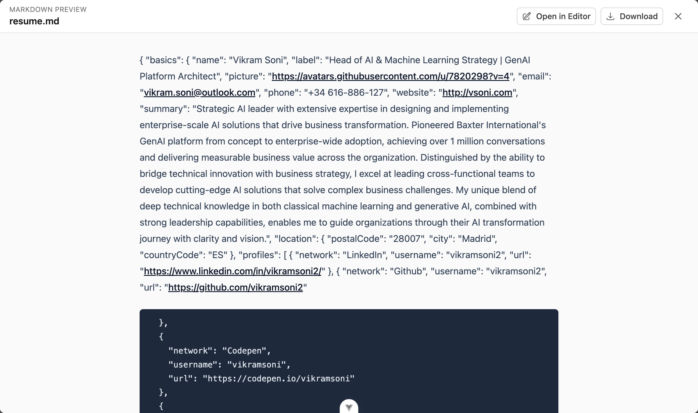
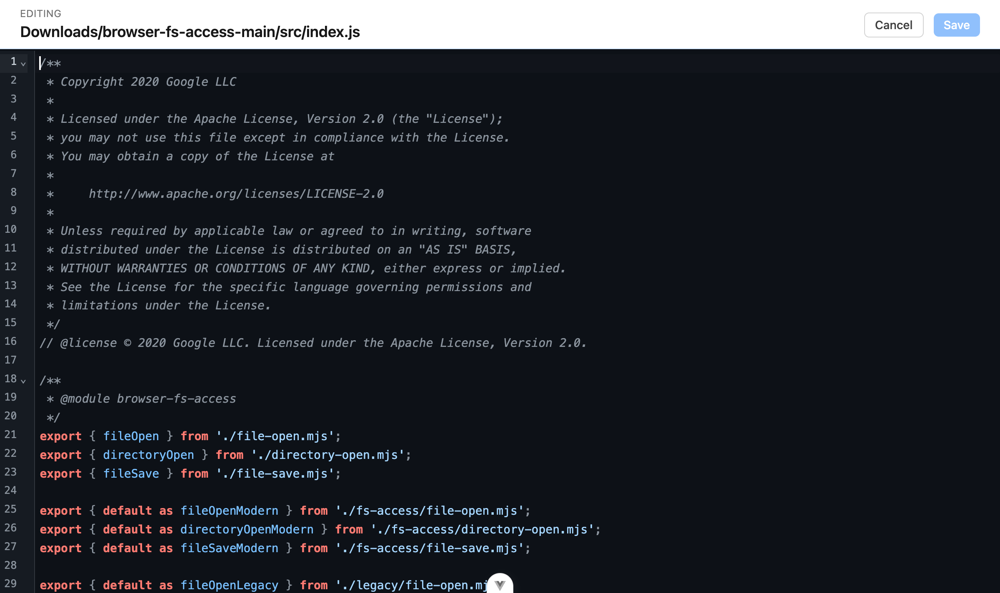
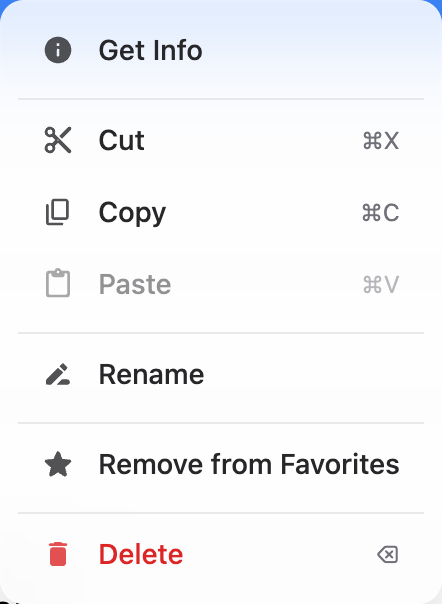
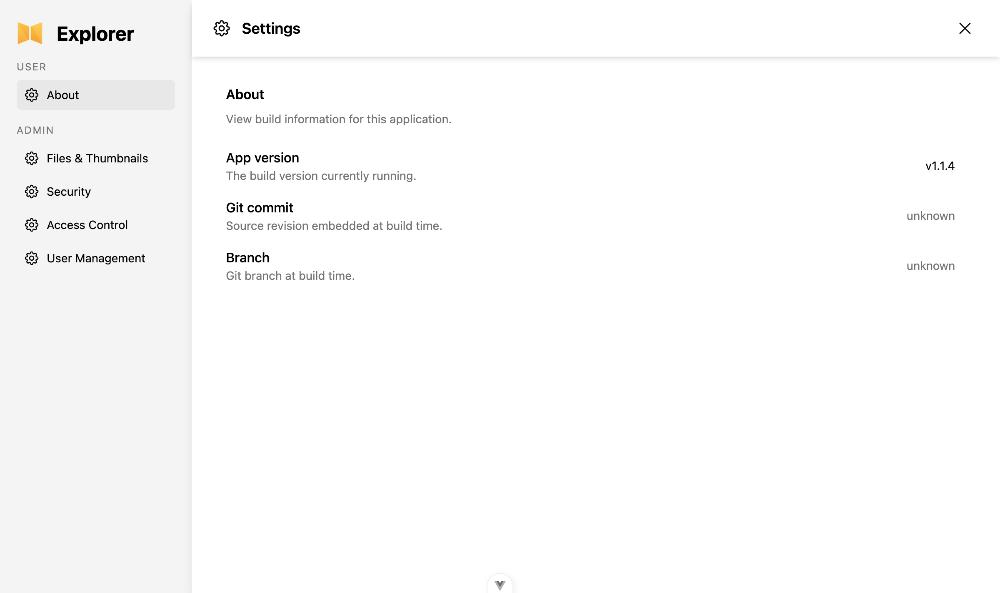

# nextExplorer Visual Tour

nextExplorer keeps the essentials — authentication, volumes, previews, and settings — visible in one clean interface. The screenshots below walk through the flow from login to editing a file so you can reference the experience when introducing the app to teammates.

## Sign in to the workspace

The sleek login panel shows the workspace branding, field hints, and the prominent “Log In” button. Once authenticated, the app redirects to the main dashboard.

## The dashboard after login

After logging in, the navigation area highlights quick access, favorites, and volumes. The toolbar spans the top, keeping controls for uploads, view modes, search, and additional utilities within reach.

## Browsing the Downloads volume

The default grid view organizes folders and files with large folder icons and names that wrap cleanly, making it straightforward to scan large uploads.

### Pin a favorite folder

Highlight a folder and add it to Favorites with the star icon (or via the context menu) so it stays within reach in the sidebar.

## Previewing content without leaving the browser

### Double-click an image

Double-clicking an image opens a modal preview with navigation, zoom, and rotation controls so you can inspect visual assets instantly.

### Open Word documents

Documents launch in OnlyOffice directly inside the workspace. The familiar ribbon controls make it easy to read and edit without downloading the file.

### Inspect Markdown

Markdown files render an inline preview summarizing their content. The preview includes the raw Markdown data and quick buttons for opening the file in an editor or downloading it.

### Edit JavaScript files

The built-in editor surfaces syntax-highlighted JavaScript, line numbers, and quick Save/Cancel actions so you can make small tweaks directly within the browser.

## Tailoring the file list

### Switch view modes

Toggle between grid, list, column, and photo views via the toolbar icons. The list view displays metadata such as Kind and Date Modified for every entry.

### Context menu actions

Right-click any file or folder to reveal file operations like Get Info, Cut/Copy, rename, remove from favorites, or delete.

## Administration and user settings

The full settings workspace consolidates the user view with admin sections for Files & Thumbnails, Security, Access Control, and User Management. You can open it at `/settings` or via the sidebar user menu.
