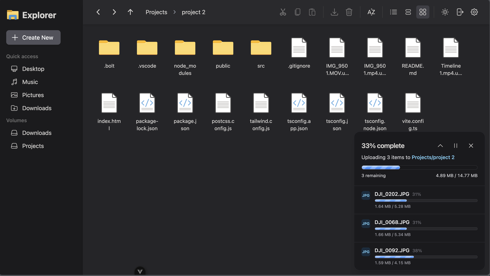

## nextExplorer Documentation

nextExplorer is a modern, self-hosted file explorer crafted for teams, creative agencies, and homelabs that demand both polish and control. It ships as a single Docker container, works perfectly with mounted volumes, and pairs seamlessly with reverse proxies or zero-trust networks.

### Key highlights

- Secure local users, groups, and optional OpenID Connect (OIDC) integrations keep sensitive files protected.
- Grid and list views adapt to every workflow, with fast previews for media, documents, and source code.
- Built-in uploads, move/copy helpers, favorites, and multi-select actions speed up repetitive tasks.
- Configurable themes, dark/light modes, and accessible keyboard shortcuts deliver a consistent experience on every device.

### Deployment snapshot

nextExplorer arrives ready to run. Drop the container on any host, mount your volumes, expose the UI port, and the explorer is live with integrated caching, thumbnails (FFmpeg), and configurable session secrets.

### Quick start

**Minimal Docker-compose to start**

```yaml
services:
  nextexplorer:
    image: nxzai/explorer:latest
    container_name: nextexplorer
    restart: unless-stopped
    ports:
      - '3000:3000'
    environment:
      - NODE_ENV=production
      - PUBLIC_URL=http://localhost:3000
    volumes:
      - /srv/nextexplorer/config:/config
      - /srv/nextexplorer/cache:/cache
      - /srv/data/Projects:/mnt/Projects
      - /srv/data/Downloads:/mnt/Downloads
```

For full set of config see [Environment Reference](configuration/environment.html).

Run it with `docker compose up -d`, then visit `http://localhost:3000` to finish the onboarding wizard.

### What’s next

- [Quick Launch Overview](/quick-launch/overview): prerequisites, first run, and volume configuration.
- [Visual Tour](/quick-launch/visual-tour): login, workspace, favorites, previews, and the screenshot inventory.
- [Experience](/experience/features): features and user workflows for browsing, uploads, search, previews, inline editing, and link-based sharing.
- [Admin & Access](/admin/guide): user management, policies, and audit trails.
- [Installation & Networking](/installation/deployment): compose deployment, backups, and runtime concerns; check the [Reverse Proxy guide](/installation/reverse-proxy) for PUBLIC_URL, trusted proxies, TLS, and CORS.
- [Configuration & Settings](/configuration/environment): environment variables and defaults; [Runtime Settings](/configuration/settings) describes in-app toggles and admin panels.
- [Personal user folders](/configuration/personal-folders): per-user “My Files” home directories with `USER_ROOT` and `USER_DIR_ENABLED`.
- [Integrations](/integrations/oidc): OIDC, Authelia, and ONLYOFFICE examples for SSO and document editing.
- [Reference](/reference/troubleshooting): troubleshooting notes, the screenshot catalog, and release changelog.

### Screenshots

|  |     |
| :------------------------------------------: | :------------------------------: |
|     Create a password to protect access.     | Unlock trusted sessions quickly. |

|            |  |
| :----------------------------------: | :-------------------------------: |
| Visual grid for media-heavy folders. |     Clean light theme option.     |

|     |          |
| :-----------------------------------------: | :-------------------------------------: |
| Detail view highlights size and timestamps. | Track multi-file uploads with progress. |
