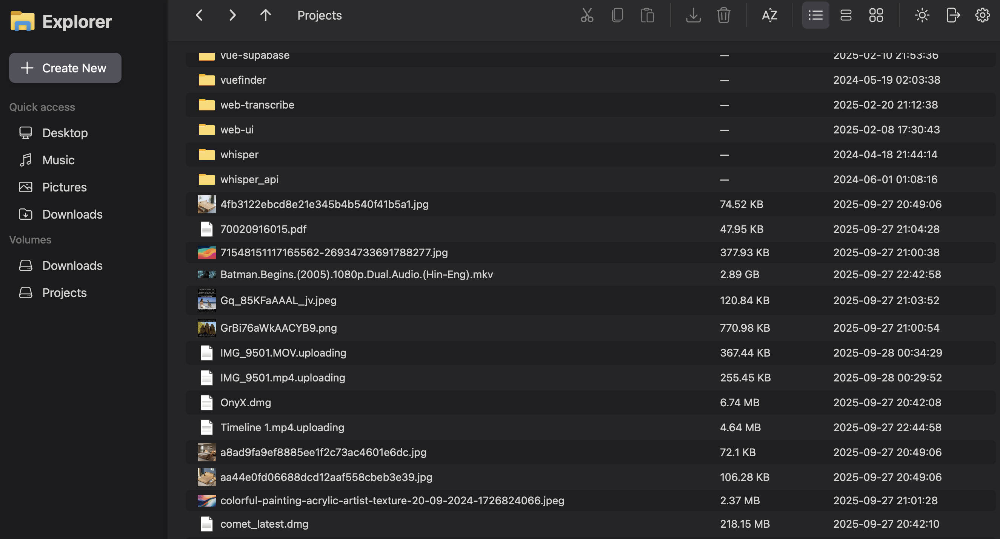

# nextExplorer Documentation

nextExplorer is a modern, self-hosted file explorer designed for teams and homelabs who want a clean UI, fast previews, and secure access control. It ships as a single Docker container and works great behind a reverse proxy.

- Secure access with local users and optional OIDC single sign‑on
- Browse, preview, upload, move, and delete files across multiple volumes
- Grid and list views, dark/light themes, quick search, and a built-in code editor
- Automatic thumbnails for images and videos (FFmpeg), with configurable size/quality

Quick start

```yaml
services:
  nextexplorer:
    image: nxzai/explorer:latest
    container_name: nextexplorer
    restart: unless-stopped
    ports:
      - "3000:3000"
    environment:
      - NODE_ENV=production
      - PUBLIC_URL=http://localhost:3000
      - SESSION_SECRET=please-change-me
      # Optional OIDC (see Authentication)
      # - OIDC_ENABLED=true
      # - OIDC_ISSUER=https://auth.example.com/application/o/next/
      # - OIDC_CLIENT_ID=nextexplorer
      # - OIDC_CLIENT_SECRET=...
      # - OIDC_SCOPES=openid profile email groups
      # - OIDC_ADMIN_GROUPS=next-admin admins
    volumes:
      - /srv/nextexplorer/cache:/cache
      - /srv/data/Projects:/mnt/Projects
      - /srv/data/Downloads:/mnt/Downloads
```

Run it: `docker compose up -d`, then visit `http://localhost:3000`.

What’s next

- Getting Started: prerequisites, first‑run, volumes
- User Guide: browsing, uploads, search, editor, favorites
- Admin Guide: user management, access control, SSO
- Authentication (OIDC): Keycloak, Authentik, Authelia examples
- Reverse Proxy: `PUBLIC_URL`, trusted proxy, CORS
- Configuration: environment variables and defaults
- Deployment: Compose examples and updates

Screenshots

|  |  |
| :--: | :--: |
| Create a password to protect access. | Unlock trusted sessions quickly. |

|  |  |
| :--: | :--: |
| Visual grid for media‑heavy folders. | Clean light theme option. |

|  |  |
| :--: | :--: |
| Detail view highlights size and timestamps. | Track multi‑file uploads with progress. |
