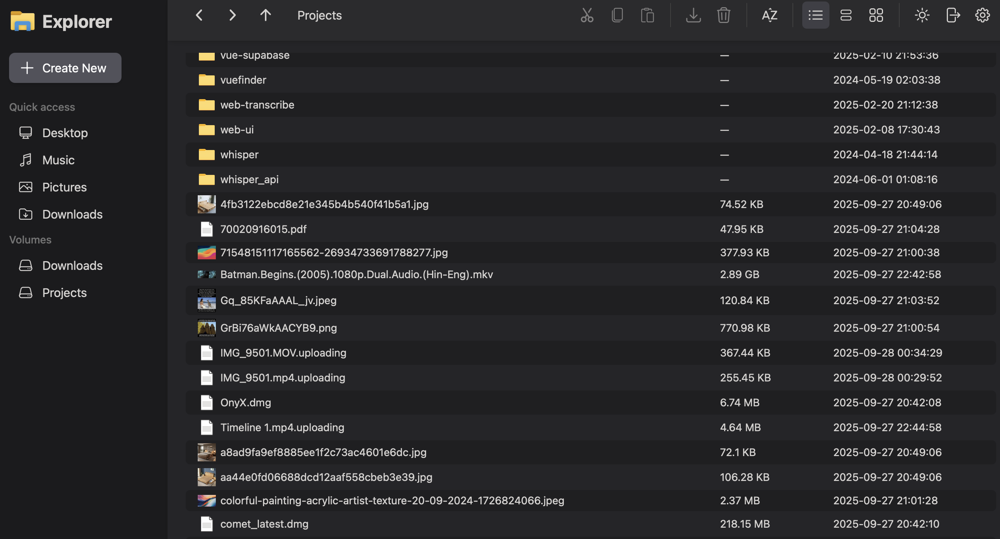

# Screenshots
| | |
| --- | --- |
|  |  |
| Lock the workspace with a master password before anyone can browse. | Re-enter the password to unlock trusted sessions. |
|  |  |
| Grid view keeps media heavy folders easy to scan. | Light theme works well for bright shared spaces. |
|  |  |
| Detail view surfaces metadata like file size and timestamps. | Track multi-file uploads with per-item progress feedback. |
